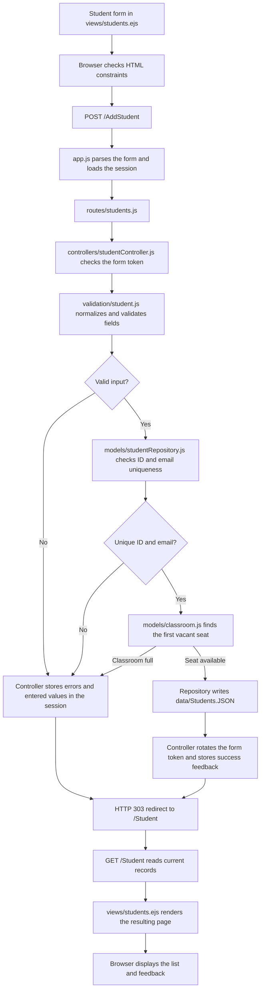

# Exercise 02 Report: Student List and Classroom Positions

**Course:** WebApp Developing

**Exercise:** Server-Side Rendering with Node.js and Express.js

## 1. Project overview

This exercise implements a student management web application using server-side rendering (SSR). A teacher can add students, view their information, and arrange their positions in a classroom. Each student has an ID, name, email, and position containing a row and column.

The application has two pages. `/Student` provides a form and a student table for managing records. `/Classroom` shows students at their saved seats and supports dragging, swapping, information popups, and an alternative movement form. Both pages support light and dark modes.

Student records are stored in `data/Students.JSON`, without a database. The server generates the HTML for both pages. Browser JavaScript handles interface interactions, while validation, storage, and rendering remain on the server.

## 2. Technical stack and reasons for choosing it

We chose this stack because it is lightweight, fast enough for this exercise, and familiar to us. It lets us focus on the request–response cycle and SSR without introducing a large frontend framework or database setup. These are project choices rather than claims based on performance benchmarks.

| Technology | Role in the application | Reason for choosing it |
| --- | --- | --- |
| Node.js | Runs JavaScript on the server and accesses the JSON file. | We are familiar with JavaScript, so we can use the same language for server code and browser interactions. |
| Express.js | Defines routes, parses form submissions, runs middleware, and sends responses. | Its small API makes the two-page application straightforward to build and understand. |
| EJS | Renders server data into HTML templates. | It integrates with Express and uses familiar HTML with simple presentation expressions and loops. |
| JSON file storage | Persists students and classroom positions. | It is easy to inspect and needs no database installation, matching the exercise requirements. |
| express-session | Stores temporary feedback and session form tokens. | It preserves validation messages and submitted values across redirects. |
| HTML, CSS, and browser JavaScript | Provide forms, responsive styling, themes, dragging, and popups. | Native browser features are sufficient for the interface and avoid additional frontend dependencies. |
| Node.js test runner | Runs automated integration tests. | It is built into Node.js and can test HTTP requests and temporary JSON storage without another testing framework. |

JSON storage is appropriate for this small, local exercise. Writes are serialized within one server process and saved through a temporary file followed by an atomic rename. Running multiple processes would require additional coordination or a different storage solution. Sessions use an in-memory store, so restarting the server clears sessions but preserves student records.

## 3. Why we chose MVC architecture

We use an MVC-style architecture to separate data management, request handling, and presentation. This directly supports the requirement that data-handling logic must not be placed in templates.

| Layer | Files | Responsibility |
| --- | --- | --- |
| Model | `models/studentRepository.js`, `models/classroom.js` | Read and save records, enforce uniqueness, assign seats, move or swap students, and prepare classroom view data. |
| View | `views/students.ejs`, `views/classroom.ejs`, `views/error.ejs`, `views/partials/header.ejs` | Display prepared data as HTML, including forms, tables, seats, and feedback. |
| Controller | `controllers/studentController.js`, `controllers/classroomController.js` | Coordinate validation, model operations, session feedback, redirects, and rendering. |

Supporting modules have narrower responsibilities: `routes/students.js` maps HTTP routes to controllers, `validation/student.js` validates student input, and `app.js` configures Express and middleware. `data/Students.JSON` stores records; it is storage rather than the model layer itself.

This separation makes changes easier to locate. For example, an ID rule changes in the validator, a storage operation changes in the repository, and a layout change belongs in a view or stylesheet. It also allows request and storage behavior to be tested without placing business logic in HTML templates.

Views contain presentation-only conditions and loops. They do not read files, validate submissions, or modify student records. MVC is not required for SSR, but it makes these boundaries clear as the application grows from a student list to a classroom arrangement tool.

## 4. Data flow

### 4.1 Viewing the student list

```text
Browser requests GET /Student
    ↓
app.js — runs middleware and loads the session
    ↓
routes/students.js — selects showStudents
    ↓
controllers/studentController.js — requests the records
    ↓
models/studentRepository.js — reads data/Students.JSON
    ↓
controllers/studentController.js — prepares students and feedback
    ↓
views/students.ejs — renders the HTML
    ↓
Browser displays the student table and form
```

### 4.2 Adding a student



The application uses **Post/Redirect/Get** for successful and rejected submissions. After processing a POST, the server responds with a `303` redirect. The browser then requests a GET page, so refreshing that page does not repeat the POST.

Successful additions receive the first vacant seat, scanning rows from the front. The updated list appears because the following GET reads the saved records and renders new HTML. Other open browser pages show changes on their next request; the application does not push updates to them automatically.

### 4.3 Viewing and changing classroom positions

For `GET /Classroom`, `routes/students.js` calls `controllers/classroomController.js`. The controller reads students through the repository, calls `models/classroom.js` to prepare the seat layout and its revision, and renders `views/classroom.ejs`.

When the teacher moves a student, the flow is:

```text
Drag or click interaction in public/classroom.js
    OR the movement form in views/classroom.ejs
    ↓
POST /Classroom/Move
    ↓
app.js → routes/students.js
    ↓
controllers/classroomController.js — checks token and request fields
    ↓
models/studentRepository.js — checks seat bounds, layout revision,
                              and student existence
    ↓
Move the student; swap positions if the destination is occupied
    ↓
Save data/Students.JSON
    ↓
HTTP 303 redirect → GET /Classroom
    ↓
Read saved positions → prepare the layout → render views/classroom.ejs
    ↓
Browser displays the updated classroom
```

The drag script submits a normal HTML form. It does not independently save records or render a new classroom, preserving the SSR approach.

## 5. Data validation

### 5.1 Browser validation

The browser provides immediate feedback using HTML input constraints in the views:

- `required` prevents empty student fields.
- `pattern` checks that the student ID follows `ST001`–`ST999`, allowing lowercase input that the server normalizes.
- `minlength` and `maxlength` constrain field lengths.
- `type="email"` checks basic email syntax.
- The classroom row input uses `type="number"`, `min="1"`, and `max="50"`; a select provides seat numbers 1–6.

Browser validation improves usability, but users can bypass it by sending requests directly or changing the page. Therefore, it is not sufficient to protect stored data.

### 5.2 Server validation

The server is authoritative. For student submissions, `validation/student.js` accepts string fields, normalizes them, and checks the following rules:

| Field | Normalization | Server rules |
| --- | --- | --- |
| ID | Trim surrounding whitespace and convert to uppercase. | Must match `ST` followed by exactly three digits; `ST000` is rejected. |
| Name | Trim surrounding whitespace and collapse repeated whitespace. | Must contain 2–100 characters after normalization and no remaining control characters. Unicode names are supported. |
| Email | Trim surrounding whitespace and convert to lowercase. | Must match the application's basic email pattern and contain at most 254 characters. |

The repository then checks ID and email uniqueness without case sensitivity. These checks occur within the serialized read–check–write operation, so simultaneous requests cannot both add the same ID or email within one server process. Email format validation does not prove that the mailbox exists.

For classroom submissions, the controller and repository verify that:

- The submitted form token matches the session token.
- The ID, row, column, and revision have the expected input types; row and column strings contain only digits.
- The row and column become integers within the allowed ranges: rows 1–50 and columns 1–6.
- The student exists in the current list.
- The submitted layout revision matches the current records. A stale page cannot overwrite a newer arrangement.

Existing JSON is also checked when read. It must contain an array of student objects with string IDs, names, and emails. Saved positions must be valid and unique. Older records without positions receive deterministic vacant seats, which are persisted on the next successful write. Invalid existing data produces an error rather than being overwritten.

### 5.3 Validation failures and related safeguards

When student validation fails, the controller stores field errors and normalized input values in the session, then redirects to `/Student`. The resulting page displays the errors and preserves the entered values. Duplicate records are handled in the same way. Rejected classroom moves redirect to `/Classroom` with feedback and leave positions unchanged.

The student form token changes after a successful addition to reject stale successful submissions. Post/Redirect/Get prevents normal refreshes from resubmitting a form, while uniqueness checks provide another safeguard against duplicate additions.

EJS escapes displayed student values to prevent input from being interpreted as HTML. Escaping is an output safeguard, separate from validating the input. The application has 15 passing integration tests covering additions, validation errors, duplicate records, legacy position handling, moves, swaps, conflicting requests, and malformed storage.
